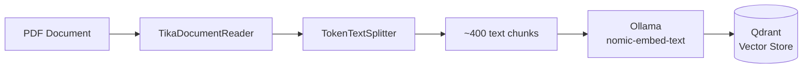
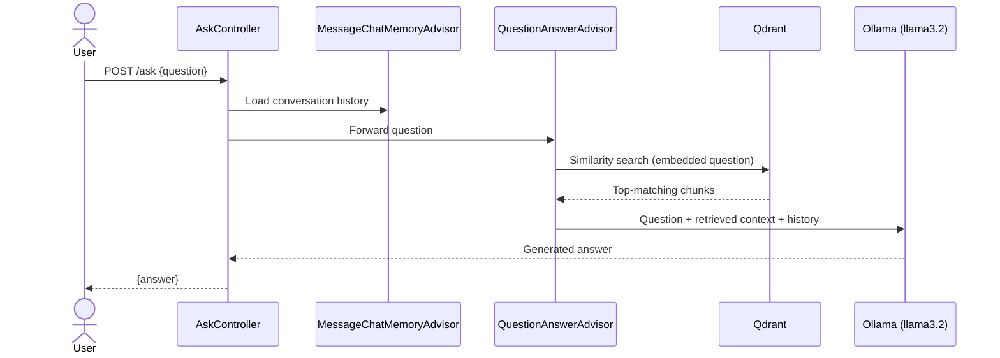

# Spring AI RAG Chatbot

A Retrieval-Augmented Generation (RAG) chatbot built with **Spring Boot** and **Spring AI**, enabling context-aware, multi-turn question answering over technical documentation. Runs entirely on local infrastructure — no external API costs, no data leaving your machine.

This project answers questions grounded in the **Spring Boot Reference Documentation** itself, using semantic search over an embedded vector store rather than relying on the model's training data alone.

---

## What it does

Ask it a question about Spring Boot — auto-configuration, testing, actuator, properties — and it retrieves the most relevant sections from the reference PDF, feeds them to a locally running LLM as context, and returns an answer grounded in that document. Conversation memory is maintained per session, so follow-up questions carry context from earlier in the chat.

---

## Tech stack

| Layer | Technology |
|---|---|
| Language | Java 21 |
| Framework | Spring Boot 3.5.7, Spring AI 1.1.0 |
| Build tool | Maven |
| LLM inference | Ollama (local) — `llama3.2` for chat, `nomic-embed-text` for embeddings |
| Vector database | Qdrant |
| Document parsing | Apache Tika |
| Infrastructure | Docker Compose (Spring Boot's Docker Compose integration) |

---

## Architecture

### Ingestion pipeline (runs once, on startup)



### Query pipeline (runs per request)



### Component responsibilities

| Component | Responsibility |
|---|---|
| `LoaderConfig` | One-time startup task: reads the configured PDF, splits it into chunks, generates embeddings, and populates Qdrant |
| `TikaDocumentReader` | Extracts raw text from the source document (supports PDF, Word, HTML, and more via Apache Tika) |
| `TokenTextSplitter` | Splits extracted text into token-sized chunks suitable for embedding and retrieval |
| `QuestionAnswerAdvisor` | Intercepts each request, performs similarity search against Qdrant, and injects relevant context into the prompt |
| `MessageChatMemoryAdvisor` | Maintains per-conversation message history, keyed by the `X_CONV_ID` header |
| `AskController` | Exposes the `/ask` REST endpoint; wires the advisors into a single `ChatClient` and returns the generated response |

On startup, the ingestion pipeline runs once: the configured document is parsed, chunked, embedded, and stored in Qdrant. On each request, the query pipeline embeds the incoming question, retrieves the most semantically relevant chunks, and passes them — along with prior conversation turns — to the LLM to generate a grounded response.

---

## Getting started

### Prerequisites
- Java 21+
- Maven
- [Docker Desktop](https://www.docker.com/products/docker-desktop/) (running)
- [Ollama](https://ollama.com/) installed locally

### 1. Pull the required models
```bash
ollama pull nomic-embed-text
ollama pull llama3.2
```

### 2. Add a document to index
Place a PDF at `src/main/resources/` and point `app.resource` in `application.properties` to it:
```properties
app.resource=classpath:/your-document.pdf
```
By default, this project is configured to load the Spring Boot Reference Documentation.

### 3. Run the application
```bash
./mvnw spring-boot:run
```

Spring Boot's Docker Compose integration will automatically start a Qdrant container. On first run, the app will read, chunk, and embed the configured document — this can take a minute or two depending on document size and hardware.

Once you see `Documents loaded into vector store` in the logs, the app is ready.

### 4. Ask a question

**Via the web UI:**
Open `http://localhost:8080` in your browser.

**Via curl:**
```bash
curl localhost:8080/ask -H "Content-Type: application/json" \
  -d '{"question": "What is Spring Boot auto-configuration?"}'
```

---

## API

### `POST /ask`

**Request body:**
```json
{ "question": "What is Spring Boot auto-configuration?" }
```

**Optional header** — `X_CONV_ID` — to maintain separate conversation memory per session/user. Defaults to a shared conversation if omitted.

**Response:**
```json
{ "answer": "..." }
```

---

## Notes on design decisions

- **Local-first LLM inference (Ollama)**: chosen over a cloud provider (OpenAI) to avoid API costs during development and keep all document content on-device. Trade-off: response latency runs roughly 10–15 seconds per query on consumer hardware, versus sub-second cloud API responses.
- **Plain-text response parsing**: earlier versions used Spring AI's structured JSON output binding (`.entity()`), but smaller local models like `llama3.2` (3B parameters) are inconsistent at strictly following JSON-schema instructions. Switched to plain-text generation with response wrapping in application code for reliability.
- **Qdrant** was used as the vector store per the base project configuration; PostgreSQL + pgvector is an alternative worth considering for teams already standardized on a relational database.

---

## Acknowledgments

Based on the [Spring AI Examples](https://github.com/habuma/spring-ai-examples) repository by Craig Walls (author of *Spring AI in Action*), adapted from Gradle to Maven, switched from OpenAI to Ollama for local inference, debugged for structured-output reliability, and extended with a custom web interface.
